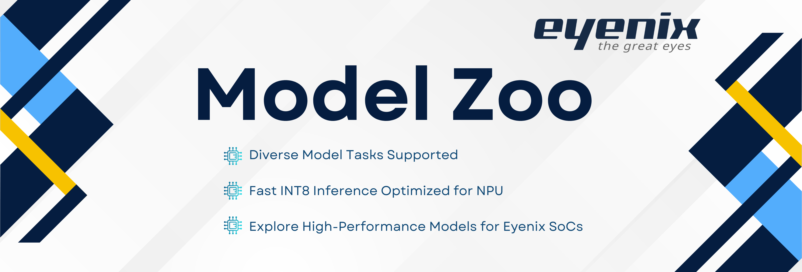

# EYENIX Model Zoo

   
  
  

Welcome to the **EYENIX Model Zoo**, a collection of high-performance deep learning models optimized for deployment on our **NPU-integrated product lineup**.

The model zoo includes both **public models**, which are pre-trained on widely used open datasets, and **release models**, which are trained in-house on Eyenix’s proprietary datasets for real-world. Using this model zoo, you can evaluate the accuracy of each model directly on Eyenix SoCs and compare performance across tasks.   
It also provides pre-compiled binary files, allowing you to run inference on the NPU immediately without additional conversion steps.
> ⚠️ **Access Notice**  
> This Model Zoo is intended **solely for EYENIX customers under a valid contractual agreement**.  
> Please note that access and usage are limited to authorized partner companies.

## 🎯 EYENIX NPU Lineup

*EN675, EN683*  
*It will be updated and shared in December.*

## ✨ Models

*It will be updated and shared in December.*

## 🚀 Getting Start

*It will be updated and shared in December.*

## 📄 License

This repository is licensed under the **MIT License**.  
You are free to use, modify, and distribute the models and code in this repository under the terms of the license.

> See [LICENSE](./LICENSE) for more details.

## 📬 Contact

For business inquiries or technical support, please contact us at:  
📧 **[eyenix support](http://www.eyenix.com/kr/support/contact.php)**  
